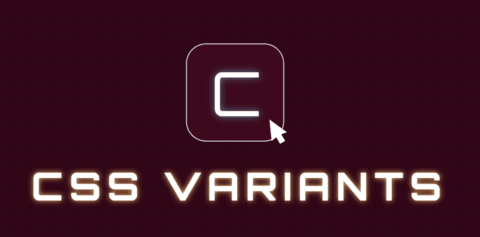

[](https://github.com/timphandev/css-variants/actions/workflows/ci.yml)
[](https://github.com/timphandev/css-variants/blob/main/LICENSE)
[](https://npmjs.com/package/css-variants)


# css-variants

A lightweight, flexible API for managing CSS class variants and inline styles in JavaScript and TypeScript projects.

## Features

- 🎨 Dynamic class name generation with variant support
- 💅 First-class inline styles support alongside class names  
- 🧩 Powerful slot-based variant system for complex components
- 📦 Zero dependencies
- 🔒 Fully type-safe with TypeScript
- 🚀 Framework-agnostic
- 🪶 Lightweight (~2KB gzipped)
- 🔥 Strong tree-shaking support
- ⚡️ Optimal runtime performance

## Installation

```bash
# npm
npm install css-variants

# yarn
yarn add css-variants

# pnpm 
pnpm add css-variants
```

## Core Utilities

css-variants provides four main utilities:

- [cv](#class-variants-cv) - Class Variants for managing single component class names
- [sv](#style-variants-sv) - Style Variants for managing single component inline styles
- [scv](#slot-class-variants-scv) - Slot Class Variants for managing multiple slot class names
- [ssv](#slot-style-variants-ssv) - Slot Style Variants for managing multiple slot inline styles
- [cx](#class-merger-cx) - Utility for composing class names conditionally.

### Class Variants ([cv](./src/cv.ts))
For managing class names for a single component:

```ts
import { cv } from 'css-variants'

const button = cv({
  base: 'font-bold rounded-lg',
  variants: {
    color: {
      primary: 'bg-blue-500 text-white',
      secondary: 'bg-gray-500 text-white' 
    },
    size: {
      sm: 'text-sm px-2 py-1',
      lg: 'text-lg px-4 py-2'
    }
  },
  compoundVariants: [
    {
      color: 'primary',
      size: 'lg',  
      className: 'uppercase'
    }
  ],
  defaultVariants: {
    color: 'primary',
    size: 'sm'
  }
})

// Usage
button() // => 'font-bold rounded-lg bg-blue-500 text-white text-sm px-2 py-1'

button({ size: 'lg' }) // => 'font-bold rounded-lg bg-blue-500 text-white text-lg px-4 py-2 uppercase'

button({ size: 'lg', className: 'custom' }) // => 'font-bold rounded-lg bg-blue-500 text-white text-lg px-4 py-2 uppercase custom'
```

### Style Variants ([sv](./src/sv.ts))

For managing inline styles:

```ts
import { sv } from 'css-variants'

const button = sv({
  base: {
    fontWeight: 'bold',
    borderRadius: '8px'
  },
  variants: {
    color: {
      primary: {
        backgroundColor: 'blue',
        color: 'white'
      },
      secondary: {
        backgroundColor: 'gray',
        color: 'white'
      }
    }
  }
})

// Usage
button({ color: 'primary' })
// => { fontWeight: 'bold', borderRadius: '8px', backgroundColor: 'blue', color: 'white' }

button({
  color: 'secondary',
  style: { padding: '4px' },
})
// => { fontWeight: 'bold', borderRadius: '8px', backgroundColor: 'gray', color: 'white', padding: '4px' }
```

### Slot Class Variants ([scv](./src/scv.ts))

For managing class names across multiple slots/elements:

```ts
import { scv } from 'css-variants'

const card = scv({
  slots: ['root', 'title', 'content'],
  base: {
    root: 'rounded-lg shadow',
    title: 'text-xl font-bold',
    content: 'mt-2'
  },
  variants: {
    size: {
      sm: {
        root: 'p-4',
        title: 'text-base'
      },
      lg: {
        root: 'p-6', 
        title: 'text-2xl'
      }
    }
  }
})

// Usage
card({ size: 'sm' })
// => {
//   root: 'rounded-lg shadow p-4',
//   title: 'text-xl font-bold text-base',
//   content: 'mt-2'
// }

card({
  size: 'lg',
  classNames: {
    content: 'custom',
  },
})
// => {
//   root: 'rounded-lg shadow p-6',
//   title: 'text-xl font-bold text-2xl',
//   content: 'mt-2 custom'
// }
```

### Slot Style Variants ([ssv](./src/ssv.ts))

For managing inline styles across multiple slots:

```ts
import { ssv } from 'css-variants'

const card = ssv({
  slots: ['root', 'title'],
  base: {
    root: { padding: '1rem' },
    title: { fontWeight: 'bold' }
  },
  variants: {
    size: {
      sm: {
        root: { maxWidth: '300px' },
        title: { fontSize: '14px' }
      },
      lg: {
        root: { maxWidth: '600px' },
        title: { fontSize: '18px' }
      }
    }
  }
})

// Usage
card({ size: 'sm' })
// => {
//   root: { padding: '1rem', maxWidth: '300px' },
//   title: { fontWeight: 'bold', fontSize: '14px' }
// }

card({
  size: 'lg',
  styles: {
    title: {
      color: 'red',
    },
  },
})
// => {
//   root: { padding: '1rem', maxWidth: '600px' },
//   title: { fontWeight: 'bold', fontSize: '18px', color: 'red' }
// }
```

### Class Merger ([cx](./src/cx.ts))

Similar to `clsx/classnames` but with better TypeScript support.

```tsx
import { cx } from 'css-variants'

// Basic usage
cx('foo', 'bar') // => 'foo bar'

// With conditions
cx('foo', { 
  'bar': true,
  'baz': false 
}) // => 'foo bar'

// With arrays
cx('foo', ['bar', 'baz']) // => 'foo bar baz'

// With nested structures
cx('foo', {
  bar: true,
  baz: [
    'qux',
    { quux: true }
  ]
}) // => 'foo bar qux quux'

// With falsy values (they're ignored)
cx('foo', null, undefined, false, 0, '') // => 'foo'
```

## Advanced Features

### Boolean Variants

Support for boolean variants to toggle styles conditionally:

```ts
import { cv } from 'css-variants'

const button = cv({
  variants: {
    disabled: {
      true: 'opacity-50 cursor-not-allowed'
    }
  }
})

button({ disabled: true }) // => 'opacity-50 cursor-not-allowed'
```

### Compound Variants

Apply styles based on combinations of variants:

```ts
import { cv } from 'css-variants'

const button = cv({
  variants: {
    color: {
      primary: 'bg-blue-500',
      danger: 'bg-red-500'  
    },
    size: {
      sm: 'text-sm',
      lg: 'text-lg'
    }
  },
  compoundVariants: [
    {
      color: 'danger',
      size: 'lg',
      className: 'animate-pulse'
    }
  ]
})

button({ color: 'danger', size: 'lg' }) // => 'bg-red-500 text-lg animate-pulse'
```

### Default Variants

Specify default variant values:

```ts
import { cv } from 'css-variants'

const button = cv({
  variants: {
    size: {
      sm: 'text-sm',
      lg: 'text-lg'  
    }
  },
  defaultVariants: {
    size: 'sm'
  }
})

button() // => 'text-sm'
```

### Custom Class Name Resolver

Use your preferred class name utility:

```ts
import { cv } from 'css-variants'
import { clsx } from 'clsx'

const button = cv({
  base: 'btn',
  variants: {
    color: {
      primary: 'btn-primary'
    }
  },
  classNameResolver: clsx
})
```

## TypeScript Support

Full TypeScript support with automatic type inference:

```ts
import { cv } from 'css-variants'

const button = cv({
  variants: {
    size: {
      sm: 'text-sm',
      lg: 'text-lg'
    }
  }
})

type ButtonProps = Parameters<typeof button>[0]
// => { size?: 'sm' | 'lg' | undefined }
```

## Inspiration

This library is inspired by several excellent projects:

- [CVA (Class Variance Authority)](https://github.com/joe-bell/cva)
- [Panda CSS](https://github.com/chakra-ui/panda)

## Contribute

If you would like to contribute to the project, please read how to contribute here [CONTRIBUTING.md](./CONTRIBUTING.md).

## License

Licensed under the MIT License.

See [MIT license](./LICENSE) for more information.
